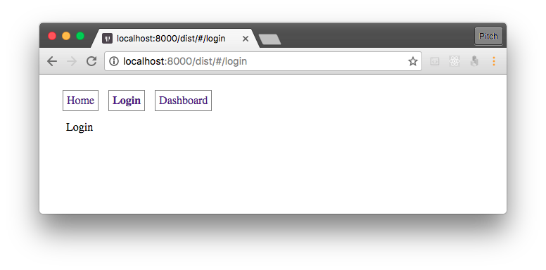

## Angular 2 RC.6 + Router + Webpack



จาก Angular 2 RC.4 เปลี่ยนเป็น RC.5 RC.6 มี Break change ลอง Migrate ที่ Production แล้วไม่ผ่าน
จึงต้องลองใหม่ตั้งแต่ตัน

## 1. สร้าง Module ชื่อ AppModule

- Import route ที่สร้างไว้โดยใช้ `RouterModule.forRoot()`
- เซ็ต Provider ด้วย `{ provide: LocationStrategy,  useClass: HashLocationStrategy }`

#### app.module.ts

```typescript
import { NgModule } from "@angular/core";
import { BrowserModule } from "@angular/platform-browser";
import { AppComponent } from "./app.component";

import { Routes, RouterModule } from "@angular/router";
import { LocationStrategy, HashLocationStrategy } from "@angular/common";

import { HomeComponent } from "./components/home.component";
import { DashboardComponent} from "./components/dashboard.component";
import { LoginComponent } from "./components/login.component";
import { routes } from "./app.router";

@NgModule({
    declarations: [
        AppComponent,
        HomeComponent,
        LoginComponent,
        DashboardComponent
    ],
    imports: [
        BrowserModule,
        RouterModule.forRoot(routes)
    ],
    bootstrap: [ AppComponent ],
    providers: [
         { provide: LocationStrategy,  useClass: HashLocationStrategy }
    ]
})
export class AppModule {}
```

#### app.router.ts

```typescript
import { Routes } from "@angular/router";
import { HomeComponent } from "./components/home.component";
import { DashboardComponent} from "./components/dashboard.component";
import { LoginComponent } from "./components/login.component";

export const routes: Routes = [
    { path: "", redirectTo: "home", pathMatch: "full"},
    { path: "home", component: HomeComponent },
    { path: "login", component: LoginComponent },
    { path: "dashboard", component: DashboardComponent }
];
```

## 2. โหลด Module ด้วย platformBrowserDynamic().bootstrapModule()

#### main.ts

```typescript
import { platformBrowserDynamic } from "@angular/platform-browser-dynamic";
import { AppModule } from "./app.module";

platformBrowserDynamic().bootstrapModule(AppModule)
    .catch(err => console.error(err));
```

## 3. เขียน Webpack config

#### webpack.config.js

```javascript
let webpack = require('webpack');
let HtmlWebpackPlugin = require('html-webpack-plugin');
let CopyWebpackPlugin = require('copy-webpack-plugin');

module.exports = {
    entry: {
        main: "./src/app/main.ts",
        vendor: "./src/vendor.ts"
    },
    output: {
        path: "dist",
        filename: "[name].js",
    },
    htmlLoader: {
      minimize: false // workaround for ng2
    },
    devtool: "source-map",
    resolve: {
        extensions: ["", ".webpack.js", ".web.js", ".ts", ".tsx", ".js"]
    },
    module: {
        loaders: [
            { test: /\.css$/, loader: "style-loader!css-loader" },
            { test: /\.tsx?$/, loaders: ["awesome-typescript-loader"] },
            { test: /\.(eot|woff|woff2|ttf|svg|png|jpg)$/, loader: 'url-loader?limit=30000&name=assets/[name]-[hash].[ext]' },
            { test: /\.html$/, loader: 'html-loader' }
        ],
        preLoaders: [
            { test: /\.js$/, loader: "source-map-loader" }
        ]
    },
    plugins: [
        new HtmlWebpackPlugin({
          filename: "index.html",
          template: "src/index.html"
        })
    ],
    externals: {
    },
};
```

## 4. Bundle ไฟล์

    > `webapck`

## Resources

- http://blog.ng-book.com/basic-routing-in-angular-2
- https://www.babelcoder.com/blog/posts/angular2-routing-and-service

